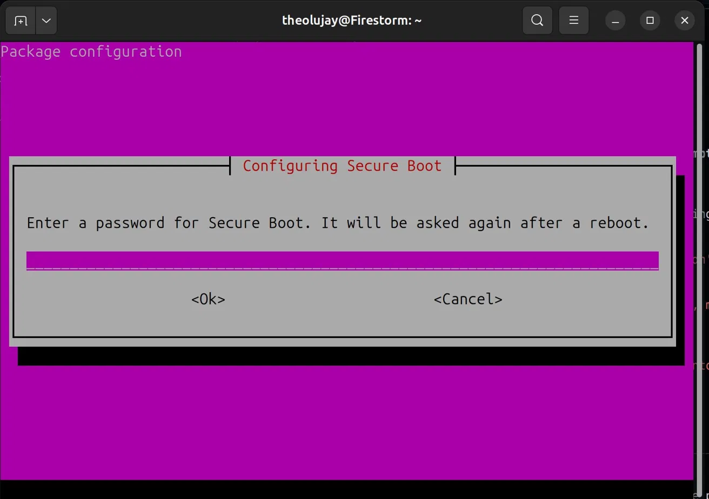

# Foundation: Environment Setup

This note covers the mental model and technical setup required for learning Ansible, primarily following the [Jeff Geerling Ansible 101](https://www.youtube.com/playlist?list=PL2_OBreMn7FqZkvMYt6ATmgC0KAGGJNAN) path.

---

## 1. The Mental Model: Why These Tools?

| Tool | Role | The "Why" |
| :--- | :--- | :--- |
| **Vagrant** | **Provisioning** | Creates the "blank canvas" (Virtual Machines). It mimics real servers on your local machine so you don't have to pay for cloud VPS instances while learning. |
| **Ansible** | **Configuration** | The "brush" that paints the canvas. It automates installing packages, hardening security, and deploying apps via SSH. |
| **Docker** | **Containerization** | Packages applications into isolated units. Ansible often handles the *host* (installing Docker), while Docker handles the *application*. |

**The Workflow:**
`Vagrant` (Give me a server) -> `Ansible` (Set it up for me) -> `Docker` (Run my app on it).

---

## 2. VirtualBox & The Secure Boot Hurdle

VirtualBox is the standard provider for Vagrant tutorials because it is cross-platform. However, modern Linux users often hit a "Secure Boot" wall.

### The Problem
Secure Boot blocks unsigned kernel modules. VirtualBox needs these modules to run.
**Error:** `modprobe: ERROR: could not insert 'vboxdrv': Key was rejected by service`

### The "MOK" Solution (Ubuntu)
Ubuntu automates this via **Machine Owner Keys (MOK)**:
1.  **Install:** `sudo apt install virtualbox`
2.  **Password:** Set a temporary MOK password when prompted (see below).
3.  **Enroll:** Reboot. On the blue screen, select **Enroll MOK** -> **Continue** -> **Yes** -> Enter the password.
4.  **Result:** Your kernel now trusts VirtualBox.



---

## 3. The "Legacy" Python Gotcha

Jeff Geerling's early tutorials use **CentOS 7**, which is old and ships with Python 2. Modern Ansible expects Python 3.

**The Fix:** You must install Python 3 on the guest VM *before* running Ansible.

```ruby
# A typical learning Vagrantfile
Vagrant.configure("2") do |config|
  config.vm.box = "geerlingguy/centos7"
  
  # Ensure Python 3 is present for Ansible to use
  config.vm.provision "shell", inline: "yum install -y python3"

  config.vm.provision "ansible" do |ansible|
    ansible.playbook = "playbook.yml"
    # Tell Ansible where to find the new Python
    ansible.extra_vars = { ansible_python_interpreter: "/usr/bin/python3" }
  end
end
```

---

## 4. Essential Vagrant Commands

- `vagrant up` - Create and start the VM.
- `vagrant ssh` - Jump inside the VM.
- `vagrant provision` - Re-run Ansible/Shell scripts without rebooting.
- `vagrant reload --provision` - Reboot the VM and run scripts (use this if you change the `Vagrantfile`).
- `vagrant destroy` - Wipe the VM entirely.

### Vagrant Provider Default

When both VirtualBox and the `vagrant-libvirt` plugin are installed, Vagrant may default to libvirt. If you see `Bringing machine 'default' up with 'libvirt' provider...` unexpectedly, set the default in `.bashrc`:

```bash
echo 'export VAGRANT_DEFAULT_PROVIDER=virtualbox' >> ~/.bashrc
source ~/.bashrc
```

### Box Provider Compatibility

Vagrant boxes are provider-specific. A box published for VirtualBox will not work with libvirt and vice versa. For example, `geerlingguy/centos7` only has VirtualBox builds.

**Error:** `The box you're attempting to add doesn't support the provider you requested`

If you hit this, either switch the box to one that supports your provider (e.g. `bento/ubuntu-24.04` works with both) or set `VAGRANT_DEFAULT_PROVIDER` to match the box's provider.

---

## 5. Modern Tooling to Watch

- **`mise`**: A "manager for managers." Use it to pin specific versions of Go, Node, or Python for your projects so they never conflict.
- **`Molecule`**: The standard way to *test* Ansible roles. It can spin up Docker containers or Vagrant VMs automatically to verify your code works.
- **KVM/libvirt**: A faster, Linux-native alternative to VirtualBox. Harder to set up initially, but much more performant.

---

## 6. Practical Gotchas

### Ubuntu 24.04 needs ≥512 MB RAM

256 MB causes boot timeouts — the VM runs out of memory during boot and Vagrant never sees SSH come up. Set `v.memory = 512` in your Vagrantfile.

### app2 hostname copy-paste bug

When defining multi-machine VMs, each must have a unique hostname:
```ruby
# Wrong — both app1 and app2 have the same hostname
app.vm.hostname = "orc-app1.test"

# Right
app.vm.hostname = "orc-app2.test"
```

### .gitignore negation order

Negation patterns (`!`) must appear **after** the patterns they negate. Also, you cannot un-ignore a file inside an ignored directory — use `adhoc/*` instead of `adhoc/`:
```gitignore
# Wrong — negation before directory pattern
!**/inventory.ini
adhoc/

# Right — negate contents, not directory
adhoc/*
!adhoc/inventory.ini
!adhoc/Vagrantfile
!adhoc/ansible.cfg
```
